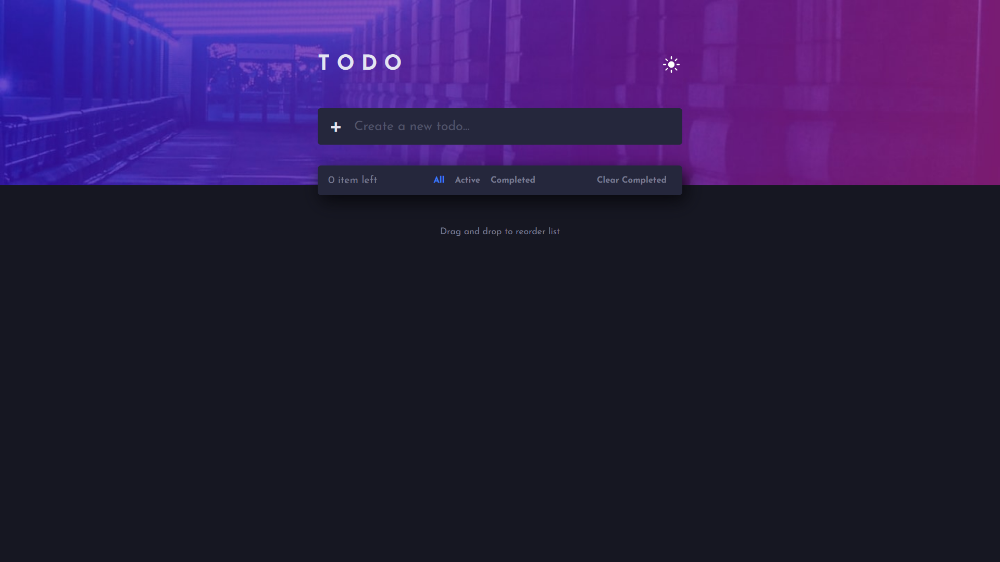

# Frontend Mentor - Bookmark landing page solution

This is a solution to the [Bookmark landing page challenge on Frontend Mentor](https://www.frontendmentor.io/challenges/bookmark-landing-page-5d0b588a9edda32581d29158). Frontend Mentor challenges help you improve your coding skills by building realistic projects. 

## Table of contents

- [Overview](#overview)
- [The challenge](#the-challenge)
- [Screenshot](#screenshot)
- [Links](#links)
- [My process](#my-process)
- [Built with](#built-with)
- [What I learned](#what-i-learned)
- [Continued development](#continued-development)
- [Author](#author)
- [Acknowledgments](#acknowledgments)

## Overview

### The challenge

Users should be able to:

- View the optimal layout for the site depending on their device's screen size
- See hover states for all interactive elements on the page
- Receive an error message when the newsletter form is submitted if:
- The input field is empty
- The email address is not formatted correctly

### Screenshot

### Links

- Solution URL: [Link](https://www.frontendmentor.io/solutions/bookmark-landing-page-Zh9MIqkAxx)
- Live Site URL: [Link](https://jish0101.github.io/react-bookmark-app/)

## My process

### Built with

- Semantic HTML5 markup
- CSS custom properties
- Flexbox
- CSS Grid
- Mobile-first workflow
- [React](https://reactjs.org/) - JS library

### What I learned

I learned about react conditional rendering, and making use of useReducer hook.

### Continued development

I'd like to add fade effect on scroll, maybe with Intersection observer class of js.

## Author

- Website - [Jishan](https://github.com/jish0101)
- Frontend Mentor - [@jish0101](https://www.frontendmentor.io/profile/jish0101)
- Twitter - [@herojish](https://www.twitter.com/jish0101)

## Acknowledgments

🌱❤️
